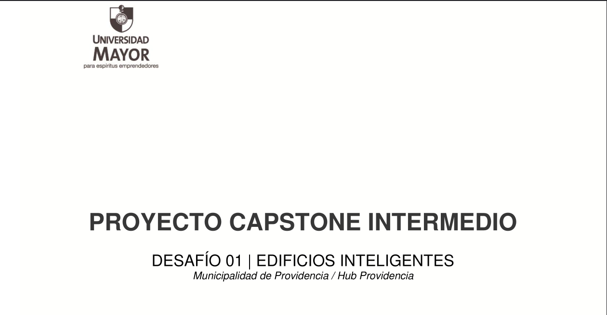

# Grupo2_Capstone
:)

***Miembros del equipo***
*Xiomara Quiroz, Ing. civil industrial*
*Michelle Jara, Ing. civil industrial*
*Felipe Cornejo, Ing. civil industrial*
*Joaquín Aguilera, Ing. civil industrial*
*Juan Millapán, Ing. civil en computación e informatica

# Objetivo:
Mejorar la circulación de las salas de trabajo del Hub Providencia.

# Bitacora Del Trabajo

-En el siguiente apartado se adjunta la bitácora del trabajo
     ***Pulse la imagen para descargar el documento***       

